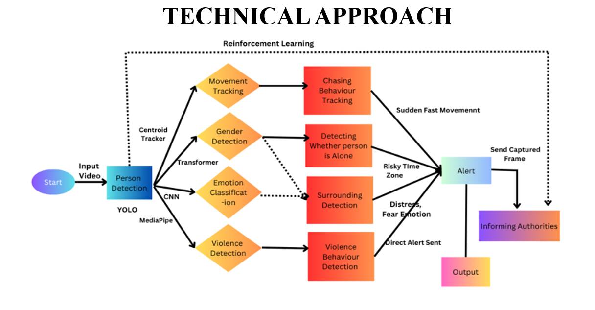
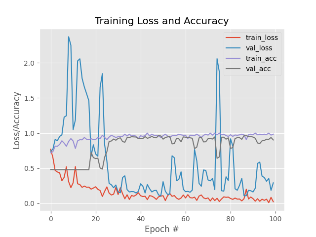
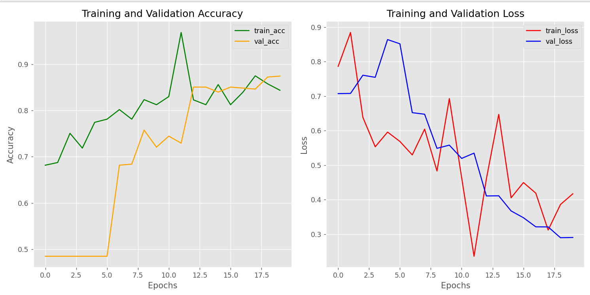
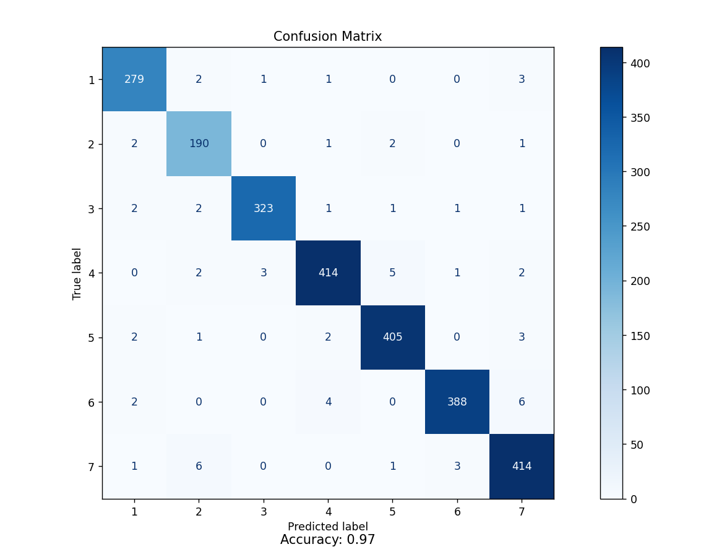

# Kavachika

Run Command: python main.py
# Women Safety Analytics Project

This repository is part of the Women Safety Analytics project, which aims to leverage deep learning and computer vision to assess threats to women in various scenarios. Below are the visual assets stored in the `artifacts` folder, along with their descriptions.

---

## 📂 Images and Descriptions

### 1. **Model Architecture**

- **Description**: 
  This image represents the architecture of the deep learning model used in the project. 
- **Purpose**: 
  To visualize and understand the structure of the machine learning model.

---

### 2. **Initial Dataset Distribution**

- **Description**: 
  This plot showcases loss/accuracy vs epochs plot which highlights both training and testing over dataset.

---

### 3. **Gender Detection Results**

- **Description**: 
  This plot illustrates the final results of the gender detection model.

---

### 4. **Gesture Detection Confusion Matrix**

- **Description**: 
  This is the confusion matrix for the gesture detection model. It shows the predicted vs. actual gestures with metrics like true positives, false positives, and false negatives.
- **Purpose**: 
  To assess the gesture detection model's effectiveness and identify areas of improvement.

---

## 🚀 Project Overview

This project integrates various machine learning and computer vision techniques to improve women's safety:

1. **Person Detection**:  
   - **Technique**: YOLO (You Only Look Once)  
   - **Purpose**: To detect individuals in surveillance footage and identify scenarios where lone women are present or surrounded by men.

2. **Gender Detection**:  
   - **Technique**: CNN (Convolutional Neural Network) built with Keras  
   - **Purpose**: To classify detected persons as male or female, helping analyze gender ratios.

3. **Gesture Recognition**:  
   - **Technique**: Random Forest Classifier combined with MediaPipe  
   - **Purpose**: To recognize SOS gestures in real-time for emergency situations.

4. **Facial Expression Detection**:  
   - **Technique**: MediaPipe  
   - **Purpose**: To analyze emotions and detect potential threats based on facial expressions.

5. **Detection of Women Surrounded by Men**:  
   - **Purpose**: To identify situations where women are in potentially unsafe environments based on the gender ratio of nearby individuals.

6. **Emergency Alerts**:  
   - **Technique**: OpenCV and Telebot  
   - **Purpose**: To send immediate alerts to the nearest police station in case of emergencies.
